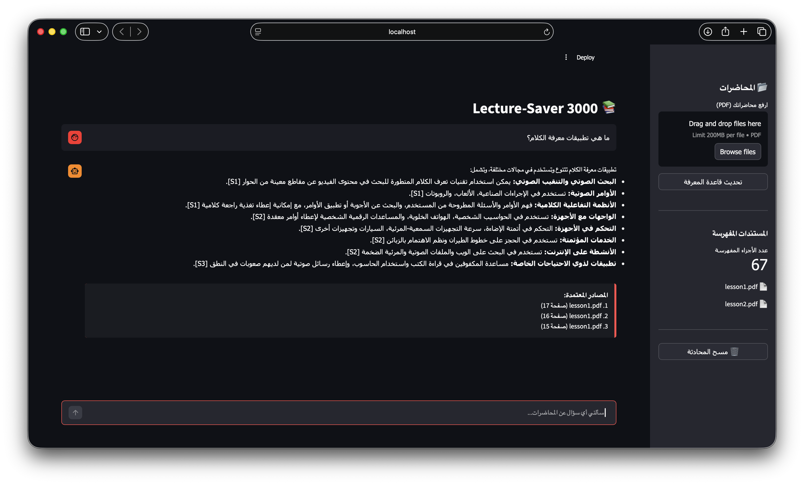
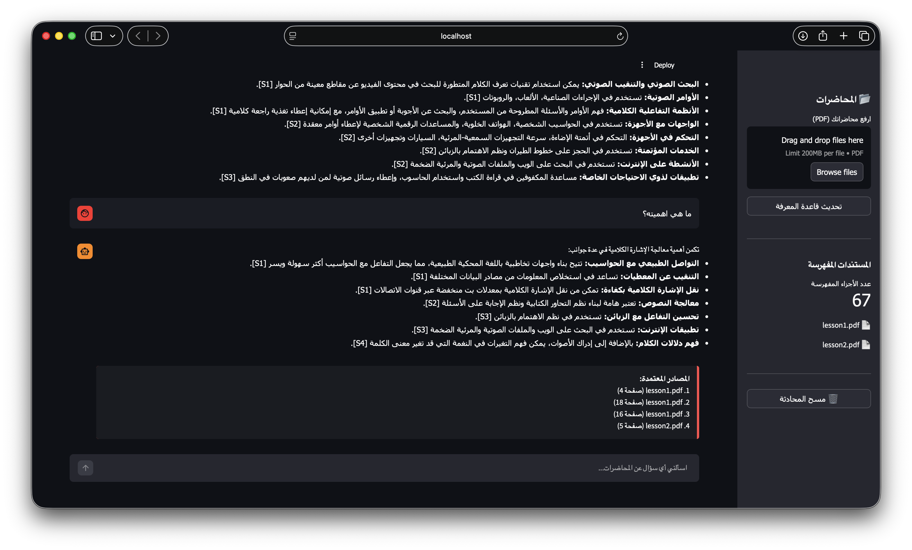
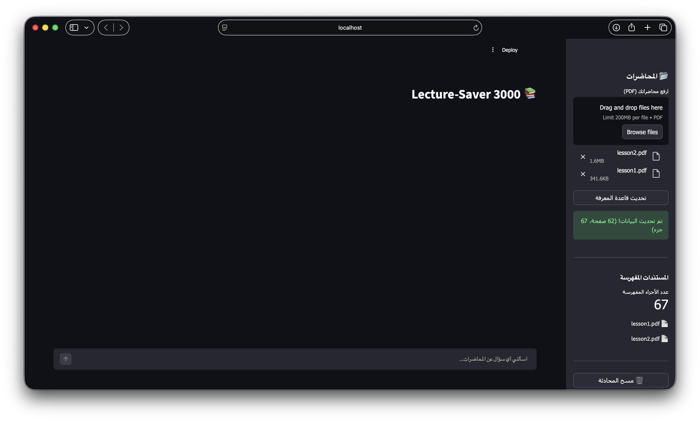

# Lecture-Saver 3000

A single-file RAG (Retrieval-Augmented Generation) pipeline that lets you upload PDF lectures and ask questions about them in Arabic. Built with a two-stage retrieval system (embedding search + cross-encoder reranking) and Google Gemini for generation.



## Features

- **Two-stage retrieval** -- semantic embedding search via ChromaDB, then cross-encoder reranking for precision
- **Conversation memory** -- chat history is passed to the LLM, so follow-up questions like "explain more" or "what about its applications?" work naturally
- **OCR fallback** -- scanned PDFs are automatically detected and processed with Tesseract OCR (Arabic + English)
- **Source citations** -- every answer includes traceable references back to the exact PDF and page number
- **Recursive chunking with overlap** -- text is split by paragraph > line > sentence > word, with 100-char overlap to preserve context at boundaries
- **Arabic-first UI** -- full RTL support, Arabic fonts, and Arabic system prompt
- **Document management** -- sidebar shows indexed documents, chunk counts, and has clear buttons for both chat and knowledge base

<details>
<summary>Follow-up questions with chat history</summary>


</details>

<details>
<summary>PDF upload and indexing</summary>


</details>

## Architecture

```
PDF Upload
    |
    v
Text Extraction (pypdf) ──> OCR fallback (Tesseract) if scanned
    |
    v
Recursive Chunking (700 chars, 100 overlap)
    |
    v
ChromaDB (paraphrase-multilingual-MiniLM-L12-v2)
    |
    v
User Question
    |
    v
Stage 1: Embedding Retrieval ──> top 15 candidates
    |
    v
Stage 2: Cross-Encoder Reranking (mmarco-mMiniLMv2) ──> top 5
    |
    v
Stage 3: Context Assembly + Chat History
    |
    v
Stage 4: Google Gemini (with system prompt + conversation memory)
    |
    v
Stage 5: Citation Processing ──> [S1], [S2] mapped to file + page
```

## Tech Stack

| Component | Technology |
|-----------|-----------|
| UI | Streamlit |
| Vector DB | ChromaDB (persistent, local) |
| Embeddings | `paraphrase-multilingual-MiniLM-L12-v2` |
| Reranker | `cross-encoder/mmarco-mMiniLMv2-L12-H384-v1` |
| LLM | Google Gemini 2.0 Flash |
| PDF Extraction | pypdf + Tesseract OCR |
| Language | Python 3.12+ |

## Setup

**1. Clone and create a virtual environment:**

```bash
git clone https://github.com/<your-username>/lecture-saver-3000.git
cd lecture-saver-3000
python3.13 -m venv .venv
source .venv/bin/activate
pip install -r requirements.txt
```

**2. Add your Gemini API key:**

```bash
echo "GEMINI_API_KEY=your_key_here" > .env
```

Get a free API key from [Google AI Studio](https://aistudio.google.com/apikey).

**3. (Optional) Install OCR dependencies for scanned PDFs:**

```bash
# macOS
brew install tesseract tesseract-lang poppler

# Ubuntu/Debian
sudo apt install tesseract-ocr tesseract-ocr-ara poppler-utils
```

**4. Run:**

```bash
streamlit run rag_pipeline.py
```

## How It Works

The entire pipeline lives in a single file (`rag_pipeline.py`, ~480 lines). Here's what happens when you ask a question:

1. **Retrieval** -- Your question is embedded and the top 15 chunks are pulled from ChromaDB by cosine similarity
2. **Reranking** -- A cross-encoder scores each (question, chunk) pair and keeps the top 5 most relevant
3. **Context assembly** -- The top chunks are tagged [D1]-[D5] with their source metadata
4. **Generation** -- The context, your recent chat history (last 10 turns), and a structured Arabic system prompt are sent to Gemini
5. **Citation mapping** -- Internal tags (D1, D2) in the answer are replaced with sequential source labels (S1, S2) and displayed with file name + page number

## Project Structure

```
.
├── rag_pipeline.py          # The entire application
├── requirements.txt         # Python dependencies
├── .env                     # API key (not committed)
├── .gitignore
├── docs/
│   └── screenshots/         # App screenshots
└── README.md
```

## License

MIT
